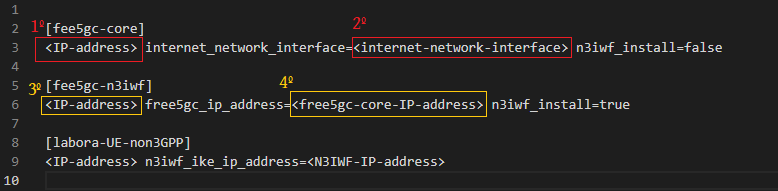

# Setup non3GPP
Passos para o setup do ambiente non3GPP.

### Ambiente
O conteúdo descrito neste repositório foi testado em um ambiente de nuvem da [Digital Occean](https://www.digitalocean.com/). 1ª VM onde o free5GC será executado (exceto N3IWF) e 2ª VM onde o N3IWF será executado, cada uma com as seguintes configurações:

* SO: Ubuntu 20.04 (LTS) x64
* Uname -r: 5.4.0-122-generic
* Memory: 4 GB
* Disk: 10 GB

#### Antes de começar
A configuração do ambiente de desenvolvimento é executada pelo Ansible. Antes de iniciar, é necessário instalar na sua máquina (supondo que ela será a máquina do operador, que vai acessar via SSH as VMs e instalar os elementos) o ansible. Abra o terminal da sua máquina e execute o comando a seguir:
```
sudo apt update && apt -y install python && sudo apt -y install git && sudo apt -y install ansible
```

Para que o ansible consiga acessar as VMs e executar o processo de instalação é necessário ter acesso root através de chaves SSH.  Isso é feito por meio de uma troca de chaves SSH, conforme descrito a seguir:

* Gerando a chave SSH:
```
ssh-keygen -t ecdsa -b 521
```
obs: após a execução do comando acima precione ENTER 3x.

* Após gerar, vamos copiar a chave para cada uma das VMs:
```
ssh-copy-id -i ~/.ssh/id_ecdsa.pub root@<free5gc-ip-address>
ssh-copy-id -i ~/.ssh/id_ecdsa.pub root@<n3iwf-ip-address>
ssh-copy-id -i ~/.ssh/id_ecdsa.pub root@<ue-non3gpp-ip-address>
```

Após copiar, é necessário testar o acesso a cada uma das VMs. É importante verificar se o acesso é root, pois o Ansible necessita de controle total para executar o setup dos componentes.


### Procedimento para o Setup do Ambiente
Primeiro vamos clonar o repositório através do comando a seguir:
```
apt update && git https://github.com/ciromacedo/ImmersiveQoe.git 
```

Após clonar o projeto, é necessário editar o arquivo **hosts**, localizado em _ImmersiveQoe/non3gpp-install_. O arquivo _hosts_ contém 3 hosts mapeados (_fee5gc-core_, _fee5gc-n3iwf_ e _labora-UE-non3GPP_). Vamos configurar fee5gc-core e fee5gc-n3iwf.

Vamos começar com as configurações do host responsável por executar o fee5gc-core.
* Substitua o primeiro marcador ```<IP-address>```, ilustrado na figura a seguir em vermelho, pelo endereço IP da VM onde o fee5gc-core será configurado.
<p align="center">
     
</p>

* Acesse a VM do _fee5gc-core_, execute o comando ```ifconfig``` e anote o nome da interface de rede que dá acesso a internet **internet network interface**, conforme ilustrado a seguir:
<p align="center">
     
</p>
substitua o º marcador```<internet-network-interface>```, ilustrado na figura a seguir na cor vermelha, pelo nome da interface de rede que dá acesso a internet.
<p align="center">
     
</p>
Obs: Mantenha o parâmetro n3iwf_install com o valor FALSE para o host _fee5gc-core_

* Substitua o 3º marcador ```<IP-address>```, ilustrado na cor amarela na figura a seguir, pelo endereço IP da VM onde  _fee5gc-n3iwf_ será configurada.
* Substitua o 4º marcador ```<free5gc-core-IP-address>```, ilustrado na cor amarela na figura a seguir, pelo endereço IP da  VM onde o _fee5gc-core_ será configurado (mesmo endereço IP informado no 1º marcador).
<p align="center">
     
</p>

### Testando a conexão do Ansible
Agora vamos testar a conectividade do Ansible com os hosts configurados anteriormente. Em um terminal, dentro do diretório ```_ImmersiveQoe/non3gpp-install```, execute o comando a seguir:
```
ansible -i ./hosts -m ping all -u root
```
Deverá ser apresentado como resultado no terminal um _pong_ para  cada um dos hosts.

### Instalando GO via Ansible
O comando a seguir vai instalar a versão GO v.1.14 nas VMs do free5gc e da N3iwf. O comando deverá ser executado no termninal dentro do diretório ``_ImmersiveQoe/non3gpp-install```.

```
ansible-playbook ./go-install-1.14.yaml -i ./hosts
```

Diferentemente do free5gc e da n3iwf, o UE-non3GPP faz uso da versão 1.21 do Go. A instalação pode ser realizada com o comando abaixo:
```
ansible-playbook ./go-install-1.21.yaml -i ./hosts
```

Após a instalação é necessário entrar em cada uma das VMs e atualizar o bashrc com o comando a seguir:
```
source ~/.bashrc
```

### Instalando Free5GC e N3IWF
Agora vamos executar os playbooks para instalação do free5gc, n3iwf e UEnon3Gpp.
#### Free5GC
```
ansible-playbook ./free5gc-setup.yaml -i ./hosts 
```
#### N3IWF
```
ansible-playbook ./n3iwf-setup.yaml -i ./hosts
```

### UE-non3GPP
```
ansible-playbook ./ue-non3gpp-setup.yaml -i ./hosts
```

### Inicializando o free5GC
Após realizar a instalação do Free5gc, N3IWF e UE-non3gpp, o próximo passo é inicializar as funções de rede do Free5gc. Para isso, é necessário acessar a VM onde o Free5gc foi implantado em dois terminais diferentes: o primeiro será usado para inicializar as funções de rede e o segundo para inicializar a API que fornece acesso ao MongoDB.

#### Inicializando as funções de rede do Free5GC
Usando o primeiro terminal conectado à VM onde o Free5gc foi instalado, vá para o diretório ```/root/go/src/free5gc```. Primeiramente, é necessário compilar as funções de rede do Free5gc. Execute o comando ```make``` e aguarde alguns segundos, pois o processo pode demorar um pouco. Após compilar o projeto (espera-se que nenhum erro tenha ocorrido durante o processo de compilação), vamos inicializar as funções de rede usando o script ```run.sh```. Pode ser necessário atribuir permissões adicionais para executar o script; isso pode ser feito com o comando ```chmod 777 -R ./run.sh```. Após atribuir a permissão, inicialize as funções de rede do Free5gc através do seguinte comando ```./run.sh```. O terminal estará vinculado ao processo de execução, reproduzindo as mensagens de log das funções de rede conforme cada função executa suas responsabilidades.

#### Inicializando a API do Free5GC para Registrar o UEnon3GPP
Usando o segundo terminal, vamos agora inicializar a API que fornece acesso aos endpoints de registro do MongoDB. No terminal, acesse o diretório ```/root/go/src/free5gc/webconsole``` e, em seguida, execute o seguinte comando ```go run server.go```. Após alguns segundos, uma mensagem de log equivalente a esta será exibida: ```Listening and serving HTTP on :5000```.

#### Inicializando a N3IWF
Inicializar o N3IWF é similar ao processo realizado ao inicializar o Free5GC, porém, apenas 1 terminal será necessário. Acesse a VM onde o N3IWF foi instalado e navegue até o diretório ```/root/go/src/free5gc/NFs/n3iwf```. Após acessar o diretório, execute o seguinte comando ```go run cmd/main.go```. Na primeira execução, algumas dependências serão configuradas, e após alguns segundos, uma mensagem de log similar a ```[INFO][N3IWF][Init] N3IWF running...``` será exibida. Isso indica que o N3IWF está pronto e conectando-se adequadamente ao Free5GC inicializado anteriormente.

### Registrando o UE-non3GPP no Free5GC
Com as funções de rede do Free5gc inicializadas e a API de acesso ao MongoDB respondendo na porta 5000 da VM onde o Free5GC está localizado, o próximo passo é registrar o UE no banco de dados. Para isso, acesse a VM onde o UE foi instalado e vá até o diretório ```~/go/src/UE-non3GPP/dev```. Usando o comando ```ls```, você pode verificar que um arquivo chamado ```include_ue_non3GPP.sh``` foi criado neste diretório. Este é um script que, usando o comando ```curl```, faz uma chamada à API do Free5GC com o objetivo de adicionar um UE contendo os mesmos parâmetros já inseridos no arquivo de configuração ```~/go/src/UE-non3GPP/config/config.yaml```. Você provavelmente precisará atribuir permissão adicional para executar o arquivo ```include_ue_non3GPP.sh```, o que pode ser feito com o seguinte comando ```chmod 777 -R ./include_ue_non3GPP.sh```. Após atribuir a permissão, basta executar o script com o comando ```./include_ue_non3GPP.sh```. Como resultado, um par de chaves indicando um objeto ```JSON``` vazio será impresso no LOG assim: ```{}```, tudo certo! Além disso, você pode verificar o terminal do Free5GC onde a API foi inicializada e observar mensagens de LOG indicando o registro do UE. Caso uma mensagem de erro com um texto semelhante a ```PostSubscriberByID err: RestfulAPIPostMany err: must provide at least one element in input slice``` seja exibida no terminal respectivo, você pode ignorá-la, tudo está conforme o esperado!

### Configurando os parâmetros no UE-non3GPP
Os parâmetros de configuração do UE estão contidos no arquivo ```~/go/src/UE-non3GPP/config/config.yaml```. Utilizando o processo de instalação descrito neste repositório, todos os parâmetros foram configurados corretamente de forma automatizada, de modo que não foram necessários ajustes no arquivo de configuração.

### Inicializando o UE-non3GPP (Interface plano de dados do Usuário)
A etapa final é inicializar o UE-non3GPP para que os túneis de controle e dados sejam configurados através do N3IWF. Para isso, acesse a VM onde o UE-non3GPP foi instalado, vá até o diretório ```~/go/src/UE-non3GPP``` e execute o seguinte comando: ```go run cmd/main.go ue```. Após configurar algumas dependências, a conexão com o N3IWF será estabelecida corretamente e duas interfaces de rede serão criadas, a primeira do tipo ```ipsec``` e a segunda chamada ```gretun1```. Para testar o funcionamento, basta executar um teste de PING através da interface ```gretun1``` com o seguinte comando: ```ping -I gretun1 8.8.8.8```.

## API e WebConsole - Métricas com UE-non3GPP
O UEnon3GPP possui uma API e uma DashBoard para coleta de métricas.

### Inicializando a API
As configurações do servidor estão contidas no arquivo ```UE-non3GPP/webconsole/config.config.yaml```. Neste arquivo, você pode personalizar o endereço IP e a porta onde os serviços estarão disponíveis. Para iniciar o servidor, execute o seguinte comando dentro da pasta webconsole:
```
go run server.go
```
Atenção: para o funcionamento correto, é obrigatório que o UE-non3GPP esteja em execução. Após o comando acima, os seguintes serviços estarão disponíveis:

### Coletando informações de conexão entre UE-non3GPP e N3IWF
Fornece informações sobre métricas de conexão durante os procedimentos de registro entre UE e N3IWF (RegisterTime, PduTime, SecurityTime, AuthTime e IpsecTime)
```
<<ue-non3gpp-server-ip>>:<<ue-non3gpp-server-port>>/ue/info
```

### Vazão da interface de rede
Coleta informações de taxa de transferência da interface de rede em um intervalo de tempo. Possui dois parâmetros de caminho obrigatórios: (i) **:interface**, que deve ser substituído pelo nome da interface de rede a ser monitorada (__gretun1__ para plano de dados ou __ipsec0-default__ para plano de controle); (ii) **:interval**, que deve ser substituído por um valor inteiro que representa o número de segundos em que se deseja realizar a coleta; por exemplo, ao passar o valor inteiro 10, os valores serão coletados a cada 1 segundo por 10 segundos. A cada segundo serão calculados: ThroughputIn e ThroughputOut.

```
<<ue-non3gpp-server-ip>>:<<ue-non3gpp-server-port>>/ue/interface/:interface/throughput/monitor/:interval
```

### Métricas de WiFi
```
http://<ip-ue-api>:<port>/ue/interface/<wifi-interface-name>/wifi/metrics/<interval>
```

### Inicializando DashBoard
A inicialização da Dash deve acontecer no diretorio  ```UE-non3GPP/webconsole/frontend```. Antes de inciar deve-se informar o IP da api para coleta de métricas. Abrir em algum editar (e.g nano ou vi) o arquivo ```UE-non3GPP/webconsole/frontend/src/app/services/api-config.service.ts``` e adicionar o IP da API na linha 8. Salvar e fechar o arquivo e executar o comando  ```ng serve --host <<ue-non3gpp-ip>>```.